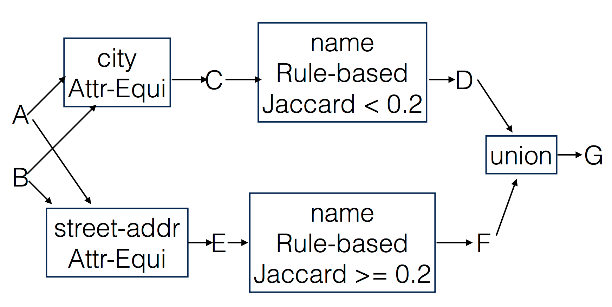

# Data Matching

## Overview
This is the class project of CS784 Data Models and Languages. In this project, we crawled to retrieve HTML data from two web sources, and performed information extraction to convert the HTML data into two relational tables. Then, we used Magellan, a data matching system developed here at Wisconsin, to match the two tables. The project has three stages: data crawling and extraction, blocking, and matching.

Project webpage: [https://blackruan.github.io/data-matching/](https://blackruan.github.io/data-matching/).

## Data Crawling & Extraction
We chose **Yelp** and **Yellow Pages** as our two web sources and crawled 9,947 restaurant htmls from **Yelp**, 28,787 htmls from **Yellow Pages**. Next, [BeautifulSoup Package](https://www.crummy.com/software/BeautifulSoup/) was used to extract the information from html and convert it into two relational tables (csv format). 

## Blocking
After the previous stage, we had 9,947 tuples in table A (Yelp), 28,787 tuples in table B (Yellow Pages). If we go on with these tables directly, we would have approximately 280,000,000 tuple pairs to perform matching, which was way too many for the matching system. Thus, we needed to apply some simple rules to perform blocking before we go into the next stage. The rules we developed are as follows.

Check [blocking explanation](https://blackruan.github.io/data-matching/blocking_explanation.pdf) for more information. After blocking, the original 280,000,000 tuple pairs was reduced to roughly 21,000 pairs.

## Matching
We performed cross validation on each of the following methods to select the best matcher.

1. Decision Tree (DT)
2. Random Forest (RF)
3. Support Vector Machine (SVM)
4. Naive Bayes (NB)
5. Logistic Regression (LG)
6. Linear Regression (LN)

Finally, we set Random Forest as our best matcher. Check [matching explanation](https://blackruan.github.io/data-matching/matching.pdf) for more details.
